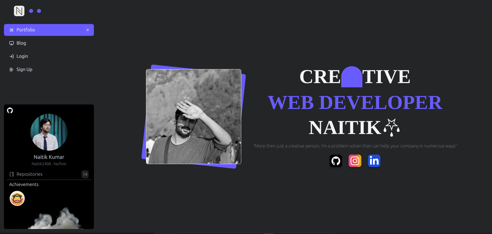

# Note App





This is my portfolio website. Visit the live demo [here](https://n2r.store)


# Contributing to My Portfolio

Thank you for your interest in contributing to my portfolio project! Your contributions are highly appreciated. Please follow the guidelines below to ensure a smooth collaboration process.

## Table of Contents
1. [Getting Started](#getting-started)
2. [How to Contribute](#how-to-contribute)
3. [Coding Standards](#coding-standards)
4. [Commit Messages](#commit-messages)
5. [Pull Request Process](#pull-request-process)
6. [Code of Conduct](#code-of-conduct)

## Getting Started

To get started with contributing, please follow these steps:

1. **Fork the repository**: Click on the "Fork" button at the top right of the repository page to create a copy of the repository under your GitHub account.
2. **Clone the repository**: Clone your forked repository to your local machine.
    ```sh
    git clone https://github.com/Naitik2408/Naitik.git
    ```
3. **Create a branch**: Create a new branch for your changes.
    ```sh
    git checkout -b your-branch-name
    ```

## How to Contribute

### Reporting Issues
If you find any bugs or have suggestions for improvements, please open an issue on GitHub. Provide as much detail as possible to help us understand and address the issue.

### Submitting Changes
1. **Make your changes**: Ensure your changes are well-documented and follow the project's coding standards.
2. **Test your changes**: Make sure your changes do not break any existing functionality and that they work as expected.
3. **Commit your changes**: Use descriptive commit messages (see below for guidelines).
4. **Push your changes**: Push your changes to your forked repository.
    ```sh
    git push origin your-branch-name
    ```
5. **Create a pull request**: Open a pull request to the main repository. Provide a clear description of the changes and the problem they address.

## Coding Standards

Please adhere to the following coding standards:

- Use meaningful variable and function names.
- Write clear and concise comments.
- Follow the project’s code style (indentation, spacing, etc.).
- Ensure your code is well-documented.

## Commit Messages

Please use the following guidelines for commit messages:

- Use the present tense ("Add feature" not "Added feature").
- Use the imperative mood ("Move cursor to..." not "Moves cursor to...").
- Provide a brief summary of the changes (50 characters or less).
- Reference issues and pull requests if applicable.

## Pull Request Process

1. Ensure your branch is up-to-date with the main branch.
2. Ensure all checks pass and there are no merge conflicts.
3. Provide a detailed description of your changes and the problem they address.
4. Include screenshots or videos if applicable to help reviewers understand your changes.

## Code of Conduct

Please note that this project adheres to a [Code of Conduct](CODE_OF_CONDUCT.md). By participating, you are expected to uphold this code.

Thank you for your contributions!

